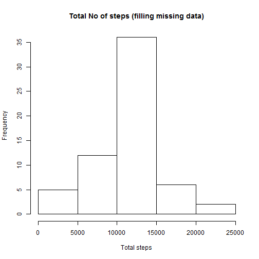

# Reproducible Research 
##  Peer Assessment 1  

### setting global options


```r
opts_chunk$set(echo = TRUE, results="asis")
```


### Loading and preprocessing the data
keep the source data "activity.csv" in your working directory

```r
	mydata <-read.csv("activity.csv", header = T)
	mydata$date1 <- as.Date(mydata$date, "%d-%m-%Y")
	mydata$weekday <- ifelse(weekdays(mydata$date1) %in% c("Staturday", "Sunday"),"Weekend","Weekdays")
```

### What is mean total number of steps taken per day?

```r
#preparing data for histogram
	outdata <- data.frame()
	for ( i in unique(mydata$date1))
	{
		data <- subset(mydata, mydata$date1 ==i)		
		totstep <- sum(data$steps, na.rm = T)
		myrecord <- c( i,  totstep)
		outdata <- rbind(outdata, myrecord)
	}
	names(outdata) <- c("date", "totstep")

#ploting the histogram
	hist(outdata$totstep,xlab="Total steps", main="Total No of steps per day")
```

 

```r
#calculating mean
	mean(outdata$totstep)
```

[1] 9354.23

```r
#calculating median
	median(outdata$totstep)
```

[1] 10395

 
### What is the average daily activity pattern?

```r
#ploting the Avg steps per 5-minute interval
	meanStepByInterval <- aggregate(mydata$steps~mydata$interval,data=mydata,FUN=mean,na.rm=T)
	names(meanStepByInterval) <- c("interval", "steps")
	plot(meanStepByInterval$interval, meanStepByInterval$steps,ylab="Mean Interval", xlab="Steps",type="l")
```

 

```r
#produing the interval for max number of steps	
	meanStepByInterval$interval[which.max(meanStepByInterval$steps)]
```

[1] 835


### Inputing missing values

```r
#producing number of missing rows
	nrow(mydata[which(is.na(mydata$steps)==T),])
```

[1] 2304

```r
#updating NA values with mean values of rest steps to a new dataset
	oldmean <- mean(mydata$steps, na.rm = TRUE)
	mynewdata <-mydata
	mynewdata$steps[is.na(mynewdata$steps)] <-oldmean

#producing new histogram
	sumByDate <- aggregate(mynewdata$steps~mydata$date1,data=mynewdata,FUN=sum,na.rm=T)
	names(sumByDate) <- c("date", "totstep")
	hist(sumByDate$totstep,xlab="Total steps", main="Total No of steps (filling missing data)")
```

 

```r
#calculating new mean
	mean(sumByDate$totstep)
```

[1] 10766.19

```r
#calculating new median
	median(sumByDate$totstep)
```

[1] 10766.19


Ans: Ouput for mean and median differs from previous calculation  

### Are there differences in activity patterns between weekdays and weekends?

```r
	library(lattice)
 #meanStepByIntWk <- aggregate(x = mynewdata$steps, by = list(mynewdata$interval, mynewdata$weekday),data=mynewdata,FUN=mean,na.rm=T)
	meanStepByIntWk <- aggregate(x = mydata$steps, by = list(mydata$interval, mydata$weekday),
			data=mydata,FUN=mean,na.rm=T)
	names(meanStepByIntWk) <- c("interval", "wk","steps")
	meanStepByIntWk <- transform(meanStepByIntWk, wk = factor(wk))
	xyplot(steps~interval | wk, data = meanStepByIntWk,  type="l", ylab="Number of Steps", xlab="Interval",
       		main="Plot of Interval vs. Number of Steps", layout=c(1,2))
```

 
